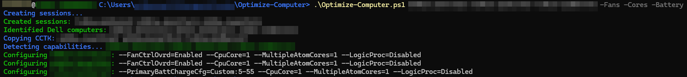

# Optimize-Computer
A PowerShell script to help optimize your computer and your workflow.

## Features
Current features:
- Need a cool breeze? Try `-Fans`!**
- Worried about power consumption? Try `-Cores`!*
- Tired of your computer acting tired? Try `-Sleep`!*
- Want to mitigate BadUSB threats? Try `-USB`!*
- Trying to maintain your battery life? Try `-Battery`!***
- Need some peace and quiet? Try `-Sound`!*
- Moving your environment to the cloud? Try `-Storage`!*
- Zoom fatigue? Try `-Camera`!***
- Dirty working environment? Try `-Filter`!**

Planned features:
- Kenophobic? Try `-FillStorage`!

*\*Dell exclusive.*  
*\*\*Dell desktop exclusive.*  
*\*\*\*Dell laptop exclusive.*  

## Screenshot/usage
